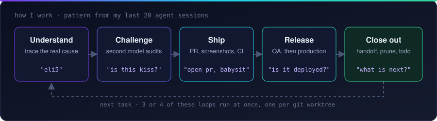
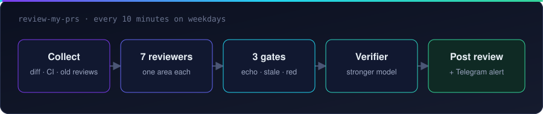

 

I'm a software engineer. I write TypeScript and Python, and I run most of my day through coding agents. I set the goal, make the design calls, and review every merge. The agents do the typing.

## What I work on

<table>
<tr>
<td width="50%" valign="top">

### Cybersecurity

Multi-tenant SaaS for governance, risk, and compliance (GRC). Integrations collect findings from security tools, and the platform turns them into a risk score for each customer.

I work across the full stack: front end, serverless API, integrations, the SQL risk engine, infrastructure as code, and production releases.

</td>
<td width="50%" valign="top">

### Real estate tech

A B2B marketplace for property management companies. Managers use it to find and manage the vendors that serve their properties.

I build full-stack TypeScript features and the end-to-end tests that cover them.

</td>
</tr>
</table>

## Recent work

- **Multi-repo feature, spec to production.** I took a feature from a written spec to stacked PRs to production. One agent session drove it for 17 days.
- **Risk score fix.** A SQL risk engine divided scores and their maximums by different numbers. I aligned them and rolled the fix through every environment.
- **Pipeline unblock.** A small CloudFormation change made the stack try to replace a security group that other stacks import. I removed the imports, deployed the change, and then added the imports back.
- **Data cleanup.** I found hundreds of orphan records in a dev environment, removed them, and closed the code paths that created them.
- **Test policy.** I sorted a large end-to-end test suite by the bugs each test can catch, deleted the low-value tests, and wrote the rules for new ones.
- **OAuth integration.** I added OAuth support to a third-party security integration.

## How I work with agents

I act as the team lead. The agents write the code. I decide what to build, check it, and say when it ships. I read my last 20 agent sessions (120 prompts), and this is the loop they show:

- **Understand before I fix.** I start with "explain the process" or "eli5". Nine prompts asked for an explanation. When data is wrong, I ask what created it before I change anything.
- **Get a second opinion.** In 4 of the 20 sessions, I sent the work to a different model to audit it. I ask it to audit the plan and the intent, not only the code.
- **Keep it simple.** I ask "is this kiss?" and "reduce ai slop". When an event-driven design for auto-reviews became complex, I dropped it and kept a cron job.
- **Short commands.** Half of my prompts have 7 words or fewer: "open pr", "proceed", "is it deployed to dev?". The agent then opens the PR with screenshots, watches CI, and answers the review comments.
- **Release in order.** Six sessions released code. Changes go to a QA environment first, then to production.
- **Close the loop.** A session ends with "status and next steps" or "can we close this session?". The agent writes a handoff comment on the issue, adds my todo, and removes old branches and worktrees.
- **Some sessions start without me.** 7 of the 20 sessions were `review-my-prs` runs that the scheduler started.

My best tool is that reviewer, `review-my-prs`. It reviews a pull request like this:

- The seven reviewers each check one area: description, intent, security, correctness, patterns, tests, and performance.
- The echo gate merges the same issue from several agents into one finding. Agreement between agents is not proof, because they share the same blind spots.
- The stale gate drops findings that a later commit already fixed.
- The red gate drops "this test will fail" claims when CI is green.
- A stronger model checks every critical and major finding again before anything is posted.

It runs every 10 minutes on weekdays. It reviews my own PRs when their required checks go green.

When a review misses something, I ask for the category of the miss, not the one bug, and add that lesson back to the skill. Large features start with a spec. Then agents question the plan, I build a prototype, and only then do I write tickets.

## Tools

  
   
  

For agents, I use omp, Claude Code, Codex, herdr, Ghostty, Tailscale, and a DGX that runs local Qwen models.

## Side projects

- A scraper that collects the prices of every exam at a local lab.
- A grocery price checker on Cloudflare, built for my wife.
- My [dotfiles](https://github.com/josetorres1/dotfiles) and [Neovim config](https://github.com/josetorres1/kickstart.nvim).

<picture>
  <source media="(prefers-color-scheme: dark)" srcset="https://raw.githubusercontent.com/josetorres1/josetorres1/refs/heads/output/snake-dark.svg"/>
  
</picture>

